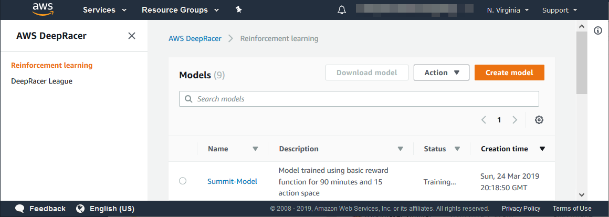
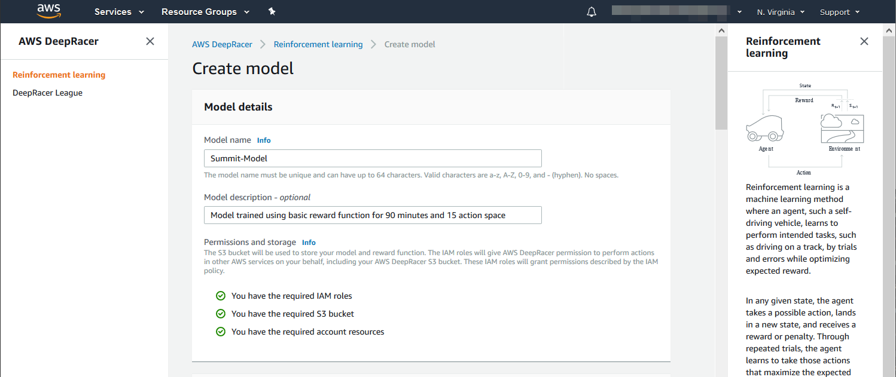
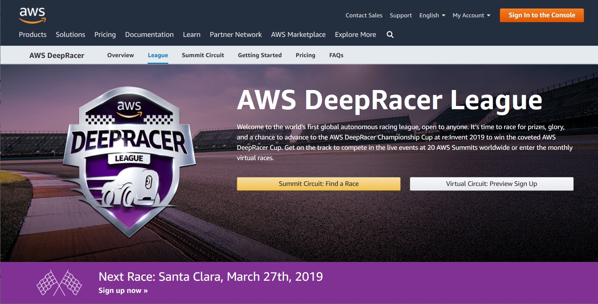
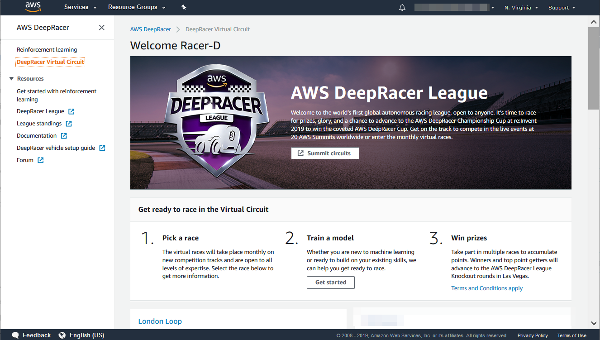
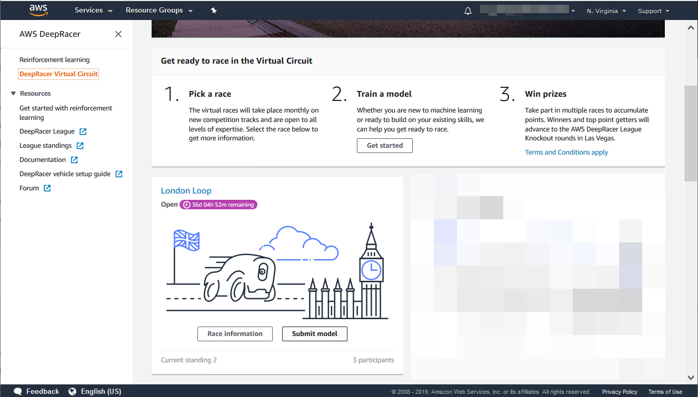
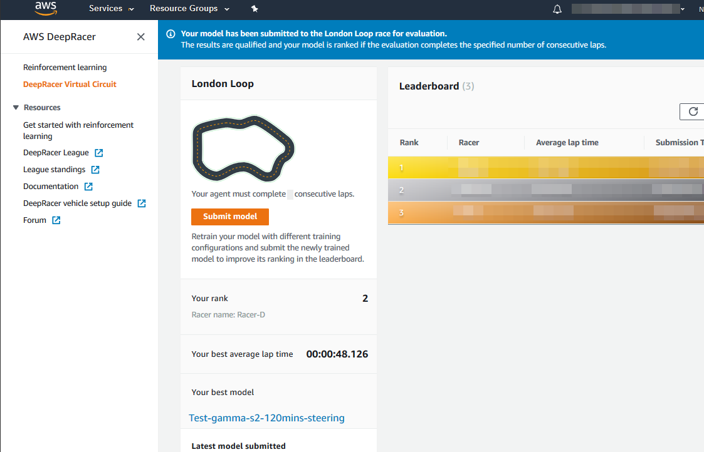
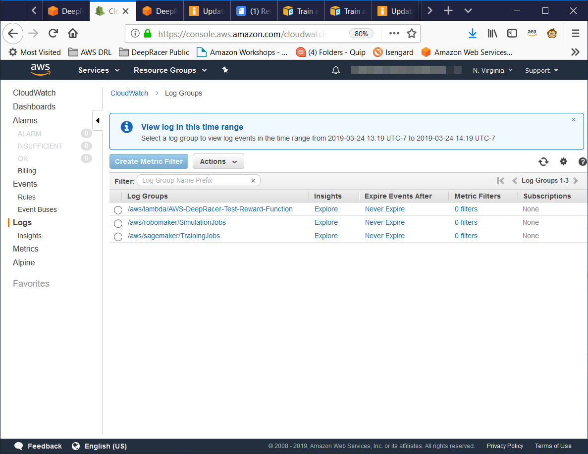
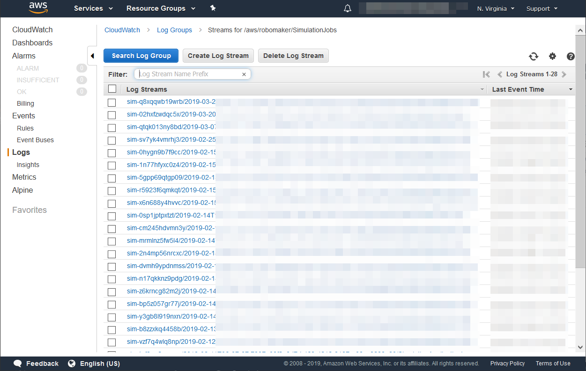
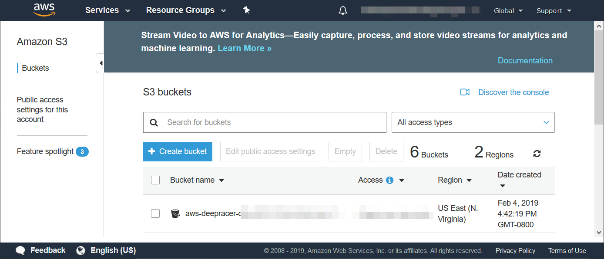

# Lab 1: AWS DeepRacer の強化学習モデルを構築しましょう!

# 注意
AWS DeepRacer サービスはより良い顧客体験を提供するため継続的に改善を重ねています。以前のコンテンツは古くなっている可能性があるため、GitHub の最新の Lab コンテンツを参照してください。もし技術的な質問がある場合はワークショップのファシリテーターに、自宅で Lab に取り組む方は [AWS DeepRacer forum](https://forums.aws.amazon.com/forum.jspa?forumID=318) (英語) に質問をポストしてください。


# 概要
この Lab には4つのゴールがあります: 

1. AWS console 内の AWS DeepRacer の使い方に慣れること、
2. モデルをトレーニングする際に必要な概念を説明すること、
3. 仮想サーキット・Summit サーキットでの AWS DeepRacer リーグの競い方を説明すること、そして、
4. モデルを向上させる方法を説明することです。

Lab は3つのセクションに分割されています: 

1. Section 1: はじめのモデルをトレーニングする、
2. Section 2: AWS DeepRacer リーグで競う、
3. Section 3: モデルのトレーニングとモデルの向上。

ゴール1と2は Section 1、ゴール3は Section 2、ゴール4は Section 3 でカバーされます。


# 形式
Lab を完了するのに50分かかります。全てのコンテンツを試し、サービス概観し、はじめの強化学習 (reinforcement learning; RL) モデルをトレーニングするのに十分な時間です。Section 1 は約25-30分、Section 2 は約5分、Section 3 はワークショップの時間よりかかると思いますが、家で試せるようになっています。Lab では AWS マネージメントコンソールで AWS DeepRacer の様々な構成要素についての詳細を紹介するので、全てを試してみることができます。Section 1 の最後でモデルのトレーニングを始めます。


# ヒント
- 仮アカウントを使っている場合、報酬関数を保存し、トレーニング済みのモデルをダウンロードするようにして下さい。Summit 終了後はアカウントへのアクセスができなくなり、アカウントは削除されます。
- 早くトレーニングジョブを始めたい人も、時間をとって予めコンセプトをよく理解し、それからモデルのトレーニングを始めることをお勧めします。
- Lab の進捗に従って質問して下さい。テーブルでの議論は自由に行ってください。
- 最後にトレーニングジョブを始める際、re:Invent トラックでは少なくとも90分はジョブを走らせて下さい。必要なサービスが立ち上がるのに6分かかり、モデルが完走するまでにレーストラックを探索する時間が必要です。
- もし Lab が終わっても学習を継続したい場合は、AWS トレーニングおよび認定チームによって提供される [AWS DeepRacer: Driven by Reinforcement Learning](https://www.aws.training/learningobject/wbc?id=32143) をご確認下さい。

# Section 1: はじめのモデルをトレーニングする
## Step 1: AWS DeepRacer サービスにログインする
提供されたアカウント情報を用いて [AWS Console](https://signin.aws.amazon.com/signin?redirect_uri=https%3A%2F%2Fconsole.aws.amazon.com%2Fconsole%2Fhome%3Fnc2%3Dh_ct%26src%3Dheader-signin%26state%3DhashArgs%2523%26isauthcode%3Dtrue&client_id=arn%3Aaws%3Aiam%3A%3A015428540659%3Auser%2Fhomepage&forceMobileApp=0) にログインして下さい。

**米国東部（バージニア北部）/ North Virginia** リージョンが選択されていることを確認し、[AWS DeepRacer](https://console.aws.amazon.com/deepracer/home?region=us-east-1) (https://console.aws.amazon.com/deepracer/home?region=us-east-1) を開いて下さい。

AWS DeepRacer のランディングページから、左ペーンを開き、**Reinforcement learning** を選択します。

## Step 2: モデルリストのページ
Reinforcement learning を選ぶと、モデルページにたどり着きます。このページはあなたが作成したすべてのモデルのリストと、それぞれのモデルの状態を表示します。もしモデルを作成したい場合、このページから始めます。同様に、このページから、モデルのダウンロード・複製・削除が行えます。



モデルがない場合、リストは空なので、**Create model** を選択してモデルを作成することができます。

モデルを作成するとこのページからステータス、例えば Training, Ready、を見ることができます。モデルステータスが Ready であるとは、モデルのトレーニングが完了し、ダウンロード・評価・仮想レースへの提出ができることを示します。モデル名をクリックし、**Model details** ページに進むことができます。


## Step 3: モデルの作成
このページで AWS DeepRacer のための RL モデルを作成し、モデルのトレーニングを開始します。ページ内にいくつかのセクションがありますが、それぞれを見る前に、まずページの一番下までスクロールして全体を眺めて、上まで戻ってきて下さい。これから AWS DeepRacer で使われる、レーストラックを自動運転で走る (アクションをとる) モデルを作成しようとしています。特定のレーストラックを選び、モデルが選択できるアクションを定義し、期待される運転方法を決めるための報酬関数を定義し、トレーニングに用いられるハイパーパラメータを設定します。


### <font color=blue>**Info**</font> **ボタン**
コンソールでの操作を通して <font color=blue>**Info**</font> ボタンが目に入ると思います。これを選択すると右からスクリーンに情報ペーンが現れます。Info ボタンは、Information ペーンのリンクを選択しない限り他のページには遷移しません。完了したらペーンを閉じることができます。


## 3.1 Model details
Model details画面の初めから設定していきます。ここでは、モデルの名前と説明を設定することができます。もしこのサービスを使用するのが初めての場合、**Create Resources**ボタンをクリックします。この操作によってDeepRacerが他のAWSサービスを使用するために必要なIAMロールが作成されます。他のAWSサービスとは、学習と評価で使用するVCPスタック、Python 3の報酬関数を検証するためのAWS DeepRacer lambda関数、モデルアーティファクトを保存するためのAWS DeepRacer S3バケットなどです。この手順でエラーが出た場合はお知らせください。




モデルの名前と説明を入力し、次のセクションまでスクロールしてください。


## 3.2 Environment simulation
ワークショップで詳しく説明されているように、RLモデルのトレーニングはシミュレータの仮想レーストラックで行われます。このセクションでは、モデルをトレーニングするトラックを選択します。 AWS RoboMakerを使用してシミュレーション環境を立ち上げます。

モデルのトレーニングを行うときは、参加したいレースのトラックを想定し、参加する予定の最終トラックに最も似ているトラックでトレーニングしてください。これは必須ではありませんし、また、良いモデルを保証するものでもありませんが、レースで最高のパフォーマンスを発揮する可能性を最大限に高めます。さらに、直線のトラックでトレーニングする場合は、曲がり方を学ばせることは期待できません。

AWS DeepRacerリーグの詳細はセクション2で説明します。このセクションでは、リーグのレースに参加する場合に、トレーニングするレースの選択にあたって注意すべきことを説明します。

- [Summit Circuit](https://aws.amazon.com/deepracer/summit-circuit/)では、ライブレーストラックはre:Invent 2018トラックです。そのため、AWS Summitのレースに参加したい場合はre:Inventトラックでモデルをトレーニングしてください。
- 仮想サーキットのそれぞれのレースには独自の競技トラックがありますが、競技トラックで直接トレーニングすることはできません。その代わりに、全く同じではありませんが、テーマやデザインが似たトラックをご利用いただくことが可能です。これによりモデルが一般化され、競技トラックに過剰適合することがなくなります。

本日のラボではSummitでのレースの準備をしていただきたいと思います。re:Invent 2018トラックを選択してAction spaceの設定画面までスクロールしてください。


## 3.3 Action space
このセクションでは、トレーニング中や、トレーニング済みのモデルから選択したアクションスペースを設定します。アクションとは、速度とステアリング角の組み合わせです。AWS DeepRacerでは、連続アクションスペースではなく離散アクションスペースを使用します。離散アクションスペースをビルドするには、Maximum speed、Speed levels、Maximum steering angle、Steering levelsを設定する必要があります。


パラメーターの説明

- Maximum steering angleは、車が曲がる際のフロントホイールの左右それぞれの最大角度です。このパラメーターはどれくらいホイールを回転させるかの上限を決めるもので、最大値は30度です。
- Steering levelsは、左右それぞれの最大ステアリング角の分割数です。Maximum steering angleを30度に設定した場合、左側に+30度、右側に-30度傾けることができます。Maximum steering angleを30度に設定し、Steering levelsに5を設定すると、ステアリング角は左から右に向かって、30度，15度、0度、-15度、-30度の5分割になります。ステアリング角は0度を中心として左右対称です。
- Maximum speedは、車がシミュレータ内を走行する最高速度です。
- Speed levelsは、0 m/sから、設定した最高速度の範囲の分割数です。アクションスペースでの速度の範囲は、0 m/sは含まれず、設定した最高速度を含みます。Speed levelsに3、Maximum speedに3を設定した場合、アクションスペースでの速度は1 m/s、2 m/s、3 m/sが使用可能です。これは単純に3 m/s÷3＝1 m/sの計算をし、0 m/sから3 m/sの間を1 m/sずつ増加させていることを意味します。

上記の例の場合、最終的なアクションスペースには15個の個別のアクション（速度が3種類 x ステアリング角が5種類）が含まれます。この情報はAWS DeepRacerサービスに表示されます。もしまだ設定されていない場合、アクションスペースを設定してください。お好きな設定をしていただいて構いません。なお、アクションスペースが大きくなるとトレーニングに少し時間がかかるかもしれません。

ヒント

- モデルはアクションスペースに無いアクションをしません。同様に、たとえば、直線トラックでモデルをトレーニングした場合、カーブを曲がることができません。つまりロバストなモデルを作りたい場合は、アクションスペースとトレーニング用トラックに注意する必要があります。
- 速い速度や広いステアリング角を設定するのは良いことですが、報酬関数やフルスピードでカーブに突っ込んだり直線でジグザグ走行しないかについて考慮する必要があります。
- 我々の実験では、最高速度が速いモデルは、遅いモデルよりも収束に時間がかかりました。
- 実際のレースにあたっては、AWS DeepRacerのWebサーバーユーザーインターフェースで実行して、シミュレータよりも車が速く走らないことを確認する必要があります。


## 3.4 報酬関数
強化学習において、報酬関数はモデルをトレーニングする上で**非常に重要な**役割をもっています。報酬関数は、トレーニングモデルが行動決定を行う際にとってほしい行動に報酬を与えるために使われます。

報酬関数は、ある行動から得られる結果を評価し、その行動に報酬を与えます。実際には、報酬はトレーニング中、各行動が取られた後に計算され、経験という形（ステート、アクション、次のステート、報酬）でモデルのトレーニングに使われます。報酬関数のロジックはシミュレータによって提供される変数によって構築することができます。これらの変数は車からの測定値を表しており、例えば、ステアリング角度、スピード、レーストラック上での(X, Y)座標や経路情報となります。これらの測定値を使い、独自の報酬関数ロジックをPython 3シンタックスを利用して実装することができます。

次のテーブルは、報酬関数で利用できる変数を表しています。これらの変数は、エンジニアやサイエンティストがよりよい方法を見つけるたびにアップデートされるため、適時作った報酬関数を調整するよう注意してください。Singapore Summit (2019年4月10日)時点での変数名・説明はAWSコンソールと同じです。AWS DeepRacer サービス内の最新の情報を常に使うようにしてください。SageMaker RL ノートブックを利用される場合は、ノートブック自体のシンタックスを確認するよう注意してください。


| 変数名        | シンタックス                                                                                | 型                     | 説明                                                                                                                                                                                                                                                                                                                                                         |
|----------------------|---------------------------------------------------------------------------------------|--------------------------|---------------------------------------------------------------------------------------------------------------------------------------------------------------------------------------------------------------------------------------------------------------------------------------------------------------------------------------------------------------------|
| all_wheels_on_track  | params['all_wheels_on_track']                                                         | Boolean                  | 4輪全てがトラック（走行路または線）上にある場合、all_wheels_on_trackはTrueとなります。1輪でもトラックの外にある場合、all_wheels_on_trackはFalseとなります。                                                                             |
| x                    | params['x']                                                                           | Float                    | 車の前車軸の中心のX座標をメートル単位で返します。                                                                                                                                                                                                                                                                                |
| y                    | params['y']                                                                           | Float                    | 車の前車軸の中心のY座標をメートル単位で返します。                                                                                                                                                                                                                                                                                 |
| distance_from_center | params['distance_from_center']                                                        | Float [0, track_width/2] | トラックの中心からの絶対距離。トラックの中心は全てのwaypointsの中心が繋げられた線により定義されます。                                                                                                                                                                                                                                      |
| is_left_of_center    | params['is_left_of_center']                                                           | Boolean                  | 車がトラックの中心から左側に位置するかどうかを示します。                                                                                                                                                                                                                                                                                     |
| is_reversed          | params['is_reversed']                                                                 | Boolean                  | 車がトラックの順方向でトレーニングしているのか、逆方向でトレーニングしているのか。                                                                                                                                                                                                                                    |
| heading              | params['heading']                                                                     | Float (-180,180]           | 車の先頭の向いている角度を示します。X軸が増加する方向（Y軸は固定）に向いている場合、0を返します。Y軸が増加する方向（X軸は固定）の場合、90を返します。Y軸が減少する方向（X軸は固定）の場合、-90を返します。 |
| progress             | params['progress']                                                                    | Float [0,100]            | 完了したトラックの割合をパーセンテージで示します。100はトラックの完了を示します。                                                                                                                                                                                                                                                                                   |
| steps                | params['steps']                                                                       | Integer [0,inf]                 | 完了したステップを返します。 1ステップは1つのstate, action, next state, rewardのセットを示します。                                                                                                                                                                                                                                                                               |
| speed                | params['speed']                                                                       | Float                    | 期待する車のスピードがメートル/秒で返されます。これは選択されたアクションに結び付けられます。                                                                                                                                                                                                                                                               |
| steering_angle       | params['steering_angle']                                                              | Float                    | 度単位で表される、ステアリングの角度。定義したAction Spaceに紐づきます。※ 正の値は左向きを表し、負の値は右向きを表します。これは2次元平面上で処理されます。                                                                                       |
| track_width          | params['track_width']                                                                 | Float                    | トラックの幅を表します                                                                                                                                                                                                                                                                                                                             |
| waypoints            | params['waypoints'] for the full list or params['waypoints'][i] for the i-th waypoint | List                     | トラックの中心の順序付きリスト。各要素は(x, y)軸を持ち、リストのインデックスは0から始まります。                                                                                                                                                                            |
| closest_waypoints    | params['closest_waypoints'][0] or params['closest_waypoints'][1]                      | Integer                  | 車の現在地から最も近いwaypointのインデックス。params['closest_waypoints'][0]は後方のインデックスを、params['closest_waypoints'][1]は前方のインデックスを示します。                                                                                                          |
|                      |                                                                                       |                          |                                                                                                                                                                                                                                                                                                                                                                     |
|                      |                                                                                       |                          |                                                                                                                                                                                                                                                                                                                                                                     |
|                      |                                                                                       |                          |                                                                                                                                                                                                                                                                                                                                                                     |


以下は報酬関数に利用できるいくつかのパラメータを図示したものです。


これはre:Inventトラックで使われた、waypointsを可視化した画像です。報酬関数の中では、waypointsの中心線のみアクセスすることができます。このグラフは、報酬関数内でwaypointsのリストを出力し、プロットすることで自身で作ることができます。print関数を報酬関数内で利用する場合、出力はAWS RoboMaker logsに置かれます。どのトラックにおいても行うことができます。詳細は後の方に記します。


報酬関数を考える上で役立つ方法は、車を上手に走らせるにはあなたならどうするのかを考えることです。簡単な例は、路上に留まり続ける車に対して報酬を与えるものです。これはreward = 1とすることで行うことができます。DeepRacerのシミュレーター上では、車がトラックの外に出た場合にはリセットし、トラックを再スタートするため、トラックを外れる行動に対して報酬を考える必要はありません。しかし、この報酬関数は、関数内部で利用できる他の全ての変数を全く利用していないため、おそらく最も優れた報酬関数とは言えません。

以下にいくつかの報酬関数の例を示します。

**Example 1**:中心線に沿った動きに報酬を与える基本的な報酬関数
ここでは、3つのマーカーによって、3つの走行帯をトラックの周りに作ります。そして、狭い走行帯を走る車により高い報酬を与えます。報酬の大きさには違いがあり、狭い走行帯で走るものには、1を、真ん中の走行帯で走るものには0.5を、一番広い走行帯を走るものには0.1を与えます。もし、狭い走行帯の報酬を減らすか、真ん中の走行帯の報酬を増やすと、トラックの走行面を広く使うように報酬を与える形になります。これは、特に鋭いカーブに有効です。


	def reward_function(params):
		'''
		Example of rewarding the agent to follow center line
		'''
		
		# Calculate 3 marks that are farther and father away from the center line
		marker_1 = 0.1 * params['track_width']
		marker_2 = 0.25 * params['track_width']
		marker_3 = 0.5 * params['track_width']
		
		# Give higher reward if the car is closer to center line and vice versa
		if params['distance_from_center'] <= marker_1:
			reward = 1.0
		elif params['distance_from_center'] <= marker_2:
			reward = 0.5
		elif params['distance_from_center'] <= marker_3:
			reward = 0.1
		else:
			reward = 1e-3  # likely crashed/ close to off track
		
		return float(reward)

ヒント: 0に等しい報酬を与えないでください。報酬を小さな値で初期化しているため、オプティマイザーは報酬に0を与えられると混乱します。 

**Example 2**:極端なステアリングにペナルティーを与え、中心線に沿った動きに報酬を与える高度な報酬関数


	def reward_function(params):
		'''
		Example that penalizes steering, which helps mitigate zig-zag behaviors
		'''
	
		# Calculate 3 marks that are farther and father away from the center line
		marker_1 = 0.1 * params['track_width']
		marker_2 = 0.25 * params['track_width']
		marker_3 = 0.5 * params['track_width']
	
		# Give higher reward if the car is closer to center line and vice versa
		if params['distance_from_center'] <= marker_1:
			reward = 1
		elif params['distance_from_center'] <= marker_2:
			reward = 0.5
		elif params['distance_from_center'] <= marker_3:
			reward = 0.1
		else:
			reward = 1e-3  # likely crashed/ close to off track
	
		# Steering penality threshold, change the number based on your action space setting
		ABS_STEERING_THRESHOLD = 15
	
		# Penalize reward if the car is steering too much
		if abs(params['steering_angle']) > ABS_STEERING_THRESHOLD:  # Only need the absolute steering angle
			reward *= 0.5
	
		return float(reward)


**Example 3**:速度を落とすのにペナルティーを与え、中心線に沿った動きに報酬を与える高度な報酬関数


	def reward_function(params):
		'''
		Example that penalizes slow driving. This create a non-linear reward function so it may take longer to learn.
		'''
	
		# Calculate 3 marks that are farther and father away from the center line
		marker_1 = 0.1 * params['track_width']
		marker_2 = 0.25 * params['track_width']
		marker_3 = 0.5 * params['track_width']
	
		# Give higher reward if the car is closer to center line and vice versa
		if params['distance_from_center'] <= marker_1:
			reward = 1
		elif params['distance_from_center'] <= marker_2:
			reward = 0.5
		elif params['distance_from_center'] <= marker_3:
			reward = 0.1
		else:
			reward = 1e-3  # likely crashed/ close to off track
	
		# penalize reward for the car taking slow actions
		# speed is in m/s
		# the below assumes your action space has a maximum speed of 5 m/s and speed granularity of 3
		# we penalize any speed less than 2m/s
		SPEED_THRESHOLD = 2
		if params['speed'] < SPEED_THRESHOLD:
			reward *= 0.5
	
		return float(reward)

これらのサンプルを利用し、自身の報酬関数を作りましょう。以下に他のTipsを示します。

- waypointsを利用し、あるwaypointと次のwaypointから方向を計算することができます。
- 2Dゲームにおける右手の法則を利用することで、トラックのどっち側にいるか判断することができます。
- 指数的に報酬を与えることができますが、最大10,000に制限してください。
- 報酬関数でspeedとsteering_angleを利用する際は、Action Spaceを覚えておいてください。
- ログ内で、ラップを完走したepisodeを追跡するには、progress = 100の際に、完走ボーナス(つまりは reard += 10000)を与えることを考慮にいれてください。これは、一度車がラップを完了した後は、progressは100以上にはなりませんが、シミュレーションは続くためです。モデルは終了時間に到達するまでトレーニングを続けますが、特に実際のレースでは、最終モデルがベストなモデルとは言えないためです。これは一時的なワークアラウンドになります。

報酬関数を作り終えたら、**Validate**ボタンを押し、コードシンタックスが正しいことをモデルのトレーニング前に確認してください。トレーニングを開始すると、報酬関数はファイルとしてS3に保存されまずが、念のためコピーし、他の場所へ保存してください。

これが、1つめの例を利用した報酬関数の例になります。


次のセクションにスクロールしてください。

## 3.5 Algorithm settings
This section specifies the hyperparameters that will be used by the reinforcement learning algorithm during training. Hyperparameters are used to improve training performance.

Before we dive in, let's just call out some terms we will be using to ensure you are familiar with what they mean.

A **step**, also known as experience, is a tuple of (s,a,r,s’), where s stands for an observation (or state) captured by the camera, a for an action taken by the vehicle, r for the expected reward incurred by the said action, and s’ for the new observation (or new state) after the action is taken.

An **episode** is a period in which the vehicle starts from a given starting point and ends up completing the track or going off the track. Thus an episode is a sequence of steps, or experience. Different episodes can have different lengths.

An **experience buffer** consists of a number of ordered steps collected over fixed number of episodes of varying lengths during training. It serves as the source from which input is drawn for updating the underlying (policy and value) neural networks.

A **batch** is an ordered list of experiences, representing a portion of the experience obtained in the simulation over a period of time, and it is used to update the policy network weights.

A set of batches sampled at random from an experience buffer is called a **training data set**, and used for training the policy network weights.

Our scientists have tested these parameters a lot, and based on the re:Invent track and a small action space these parameters work well, so feel free to leave them unchanged. However, consider changing them as you start iterating on your models as they can significantly improve training convergence.

| Parameter                                | Description                                                                                                                                                                                                                                                                                                                                                                                                                                                                                                                                                                      |
|------------------------------------------|----------------------------------------------------------------------------------------------------------------------------------------------------------------------------------------------------------------------------------------------------------------------------------------------------------------------------------------------------------------------------------------------------------------------------------------------------------------------------------------------------------------------------------------------------------------------------------|
| Batch size                               | The number recent of vehicle experiences sampled at random from an experience buffer and used for updating the underlying deep-learning neural network weights.   If you have 5120 experiences in the buffer, and specify a batch size of 512, then ignoring random sampling, you will get 10 batches of experience. Each batch will be used, in turn, to update your neural network weights during training.  Use a larger batch size to promote more stable and smooth updates to the neural network weights, but be aware of the possibility that the training may be slower. |
| Number of epochs                         |  An epoch represents one pass through all batches, where the neural network weights are updated after each batch is processed, before proceeding to the next batch.   10 epochs implies you will update the neural network weights, using all batches one at a time, but repeat this process 10 times.  Use a larger number of epochs to promote more stable updates, but expect slower training. When the batch size is small,you can use a smaller number of epochs.                                                                                                           |
| Learning rate                            |  The learning rate controls how big the updates to the neural network weights are. Simply put, when you need to change the weights of your policy to get to the maximum cumulative reward, how much should you shift your policy.  A larger learning rate will lead to faster training, but it may struggle to converge. Smaller learning rates lead to stable convergence, but can take a long time to train.                                                                                                                                                                   |
| Exploration                              |  This refers to the method used to determine the trade-off between exploration and exploitation. In other words, what method should we use to determine when we should stop exploring (randomly choosing actions) and when should we exploit the experience we have built up.  Since we will be using a discrete action space, you should always select CategoricalParameters.                                                                                                                                                                                                   |
| Entropy                                  | A degree of uncertainty, or randomness, added to the probability distribution of the action space. This helps promote the selection of random actions to explore the state/action space more broadly.                                                                                                                                                                                                                                                                                                                                                                            |
| Discount factor                          | A factor that specifies how much the future rewards contribute to the expected cumulative reward. The larger the discount factor, the farther out the model looks to determine expected cumulative reward and the slower the training. With a discount factor of 0.9, the vehicle includes rewards from an order of 10 future steps to make a move. With a discount factor of 0.999, the vehicle considers rewards from an order of 1000 future steps to make a move. The recommended discount factor values are 0.99, 0.999 and 0.9999.                                         |
| Loss type                                | The loss type specified the type of the objective function (cost function) used to update the network weights. The Huber and Mean squared error loss types behave similarly for small updates. But as the updates become larger, the Huber loss takes smaller increments compared to the Mean squared error loss. When you have convergence problems, use the Huber loss type. When convergence is good and you want to train faster, use the Mean squared error loss type.                                                                                                      |
| Number of episodes between each training |  This parameter controls how much experience the car should obtain between each model training iteration. For more complex problems which have more local maxima, a larger experience buffer is necessary to provide more uncorrelated data points. In this case, training will be slower but more stable. The recommended values are 10, 20 and 40.                           |

Note that after each training iteration we will save the new model file to your S3 bucket. The AWS DeepRacer service will not show all models trained during a training run, just the last model. We will look at these in Section 3.

## 3.6 Stop conditions
This is the last section before you start training. Here you can specify the maximum time your model will train for. Ideally you should put a number in this condition. You can always stop training early. Furthermore, if your model stopped as a result of the condition, you can go to the model list screen, and clone your model to restart training using new parameters.

Please specify 90 minutes and then select **Start training**. If there is an error, you will be taken to the error location. Note the Python syntax will also be validated again. Once you start training it can take up to 6 minutes to spin up the services needed to start training. During this time let's talk through the AWS DeepRacer League and how you can take part.


Note 25 to 35 minutes of lab time should have elapsed by this point.

Hint: Please make sure you save your reward function, and download your trained model from the burner account. You will lose access to the account after the Summit, and the account will be wiped.


# Section 2: Competing in the AWS DeepRacer League
The [AWS DeepRacer League](https://aws.amazon.com/deepracer/league/) is the world's first global autonomous racing league. The League will take place in 2019 in-person, at various selected locations, and online. Race and you stand to win one of many AWS DeepRacer prizes, or one of 47 paid trips to re:Invent 2019 where you will get to take part in the AWS DeepRacer Knockout Rounds. If you make it through the Knockouts you will get to race in the AWS DeepRacer Championship Cup. [Terms and conditions insert link here]() apply.

The in-person races are referred to as the Summit Circuit, and the online races are referred to as the Virtual Circuit. The locations of the Summit Circuit events can be found [here](https://aws.amazon.com/deepracer/summit-circuit/). The details of the Virtual Circuit will be announced when the AWS DeepRacer service is opened for general availability. You don't need to own an AWS DeepRacer to take part in either form of competition.





## Racing in the Summit Circuit
To race in the Summit Circuit you must bring your trained AWS DeepRacer RL model to the Summit on a USB stick in a folder called models. Note that we will also provide standard models as part of a walk-up experience for those who were not able to train their own models. At each even you will have to queue for time on the track, on a first come first serve basis, or as the Summit organizer determined, and have 4 minutes to try and get the best lap time using your model and a standard AWS DeepRacer car that we will make available to race with on the race track. The race track will be the re:Invent 2018 track, so train your model on the re:Invent track if you intend to race at any of the selected AWS Summits. The fastest racer at each race in the Summit Circuit will proceed to re:Invent and the top 10 at each race will win AWS DeepRacer cars.

## Racing in the Virtual Circuit
To race in the Virtual Circuit you will have to enter your models into each race, by submitting them via the AWS DeepRacer service in the AWS console. Virtual Circuit races can be seen in the [DeepRacer Virtual Circuit](https://console.aws.amazon.com/deepracer/home?region=us-east-1#leaderboards) section in the AWS DeepRacer service.



Scroll down for a list of open races



To see more info on the race, select race information.


Once you have a trained model, you can  submit it into the current open race. Your model will then be evaluated by the AWS DeepRacer service on the indicated competition track. After your model has been evaluated you will see your standing update if your lap time was better than your prior submission.



Each race in the Virtual Circuit will have its own new competition track and it won't be possible to directly train on the competition tracks. Instead we will make a track available that will be similar in theme and design to each competition track, but not identical. This ensures that models have to generalize, and can't just be overfitted to the competition track. The fastest racer in each race in the Virtual Circuit will proceed to re:Invent and the top 10 at each race will win AWS DeepRacer cars.

**Tip**: The DeepRacer service does not currently support importing models,  but you can still save your model.tar.gz file, as well as all model training artifacts. The final model is stored as model.tar.gz file in a folder called DeepRacer-SageMaker-rlmdl-account number-date in your DeepRacer S3 bucket. The interim models are stored as .pd files in a folder called DeepRacer-SageMaker-RoboMaker-comm-account number-date

After each event in the Summit Circuit and in the Virtual Circuit, all racers that took part will receive points based on the time it took them to complete the race. Points will aggregate through the season, and at the end of the seasons the top point getters will be invited to take part at re:Invent. Please refer to the [terms and conditions insert link here](https://aws.amazon.com/deepracer/faqs/#AWS_DeepRacer_League) for more details. 

# Section 3: モデルのトレーニングと改善

## 3.1: モデルのトレーニング

モデルのトレーニングが開始したら、モデルの一覧からモデルを選択できるようになります。モデルの一覧では、エピソードごとの報酬の合計値のグラフからトレーニングの進行状況を確認することができます。また、シミュレータ上の一人称視点の画像を見ることができます。

初めのうち、車はまっすぐ走らないかもしれませんが、車がより良いふるまいを学習するにつれてパフォーマンスが向上し、報酬グラフが上昇していくことが確認できるでしょう。なお、車がトラックを外れた場合はトラックがリセットされます。その際、車が同じ場所から走行を開始しなくても問題ありません。これは、ラウンドロビンを有効にして前回コースアウトした場所から次の走行を始めるようにすることで、トラック全体をトレーニングするためです。さらに、トレーニング中に車がトラックを反対方向に走ることがありますが、これは左右のカーブをバランス良くトレーニングしてモデルをより汎化させるためです。最後に、車がコースアウトしたにも関わらずトラックがリセットされない場合がありますが、これは、トレーニングによって得られた情報をAmazon SageMakerに送ってモデルを学習させるためです。更新されたモデルがAWS RoboMakerに送信されると走行が再開します。

ログファイルは、Amazon SageMakerとAWS RoboMakerのどちらからも確認することができます。ログはAmazon CloudWatchに出力されます。ログを見るには、報酬グラフの右上にある更新ボタンの下にある3つのドットをクリックして**View logs**を選択します。


ここではLambda、Amazon SageMaker、AWS RoboMakerのログを見ることができます。



各フォルダには、AWS DeepRacerで実行したすべてのトレーニングジョブのログが格納されています。AWS RoboMakerのログにはシミュレータの出力が記録され、Amazon SageMakerのログにはモデルの学習ログが記録されます。エラーが発生した場合は、これらのログを確認すると良いでしょう。



AWS DeepRacerでは、Amazon SageMaker、AWS RoboMaker、Amazon S3、Amazon Kinesis Video Streams、AWS Lambda、Amazon CloudWatchを使用しています。これらのサービスを使用すると、各サービスのステータスの確認やその他の有用な情報を得ることができます。

これらのサービスでは、保存されている現在や過去のジョブのリストを見ることができます。こちらの画像は、Amazon SageMakerで実行された学習ジョブの一覧です。


Amazon SageMakerでは、学習を実行するために使用したEC2インスタンスの使用状況のログを見ることができます。


AWS RoboMakerでは、シミュレーションジョブの一覧を見ることができます。アクティブなジョブに関しては、シミュレーション環境を直接見ることができます。


アクティブなシミュレーションジョブを一覧から選択し、Gazeboアイコンをクリックします。


新しいウィンドウが開き、シミュレーション環境が表示されます。**ここで加えた変更は即座にシミュレーションに反映されてしまうのでご注意ください。うっかり車や環境をドラッグしたり回転したりすると、トレーニングジョブに良くない影響を与えることがあります。**

 

Amazon Kinesis Video Streamは，通常、使用終了後のスペース解放やストリームの数の制限によって削除されます。この段階ではトレーニングや評価のため、動画はまだS3に格納されません。


Amazon S3はAWS DeepRacerで参照する最終モデルと、トレーニングジョブ中にトレーニングされた中間モデルをaws-deepracerバケットに格納します。報酬関数も同じバケットに保存されます。



最終モデルはmodel.tar.gzファイルとしてDeepRacer S3バケットのDeepRacer-SageMaker-rlmdl-アカウント番号-日時、という名前のフォルダに保存されます。
中間モデルは拡張子がpdのファイルとしてDeepRacer-SageMaker-RoboMaker-comm-アカウント番号-日時、という名前のフォルダに保存されます。


AWS DeepRacerサービスは、現時点では各トレーニングジョブにおいてひとつの最終モデルのみ参照することができます。ただし、トレーニングの途中で得られたモデルを使用したい場合は、model.pdファイルを最後のmodel.tar.gzファイルと入れ替えることができます。モデルが壊れる可能性があるため、tar.gzファイルの中のファイルを変更しないでください。この操作は、モデルのトレーニングが終了してから、もしくはトレーニングを手動で停止してから行ってください。

## 3.2: モデルの性能評価

ワークショップでは、ステップ2以降を行う時間がない場合があります。モデルのトレーニングが完了したらモデルの評価を行うことができます。モデルの詳細画面で**Start evaluation**をクリックすると、モデルの性能と周回数の評価を行いたいトラックを選択することができます。re:Invent 2018トラックと5周を選択してStartを選択してください。

評価が完了すると、以下のように表示されます。


## 3.3: AWS DeepRacer リーグでのレース

もしモデルに満足したら、[Summit Circuit](https://aws.amazon.com/deepracer/summit-circuit/) のレースか、今なら [Virtual Circuit](https://console.aws.amazon.com/deepracer/home?region=us-east-1#leaderboards) に参加できます。トレーニング済みのモデルを [ここ](https://console.aws.amazon.com/deepracer/home?region=us-east-1#leaderboards) から仮想サーキットで現在開催中のレースに提出して下さい。

## 3.4: モデルの向上と試行錯誤

モデルの評価に基づき、トラックを期待通り完走できたかや、平均ラップタイムについて知ることができます。なお、仮想サーキットのレースでは一定の周回数を連続して走りきる必要があるため、信頼性の高いモデルを構築する必要があります。周回数はレース毎に決定されます。

現時点では、報酬関数とハイパーパラメータを試行錯誤する必要があります。異なる運転特性に基づいた少数の異なる報酬関数を試し、シミュレータで評価し、一番よいものを選ぶといいでしょう。もし AWS DeepRacer をお持ちであれば、実機でテストすることも可能です。

ヒント: 
- トレーニング時間を長くする。もしモデルが期待通り完走できなければ、トレーニング時間を伸ばしてみて下さい。
- 最大速度を上げて行動空間を修正し、速いラップタイムを達成する。
- 報酬関数を微調整し、車がより速く走ることに対してインセンティブを与える。すなわち変数 (progress, steps, speed) を修正する。
- 過去のトレーニングを活かせるようモデルを複製する。ただし、モデルを複製した場合、行動空間を変更することはできません (変更するとジョブが失敗します)。

## 3.5: RoboMaker のログを見てモデルのパフォーマンスを分析する

さらに一歩進めたい場合、ログファイルを調べることでトレーニングジョブ実行間の各モデルのパフォーマンスを評価することができます。

CloudWatch からログファイルをダウンロードするには、[AWS CLI](https://docs.aws.amazon.com/polly/latest/dg/setup-aws-cli.html) を使って以下のように行います。

**CloudWatch から RoboMaker ログのダウンロード**


1. [Quick Analysis] ログから最新の 10000 を取得

  ```aws logs get-log-events --log-group-name  "/aws/robomaker/SimulationJobs"  --log-stream-name  "<STREAM_NAME>" --output text --region us-east-1 > deepracer-sim.log```

2. [Export Entire Log] Amazon Cloudwatch から Amazon S3 へログをコピー。次のリンクに全てのログを出力方法が記載されています: [Amazon S3](https://docs.aws.amazon.com/AmazonCloudWatch/latest/logs/S3ExportTasks.html)

Python Pandas を用いてログファイルを分析し、どのモデルが最も高い報酬を得ているかがわかります。さらに、完走ボーナスを加えると、どのモデルがラップを完了できたか知ることができます。これらのモデルはシミュレータでテストし、実世界で走らせるためのいい候補となるでしょう。


