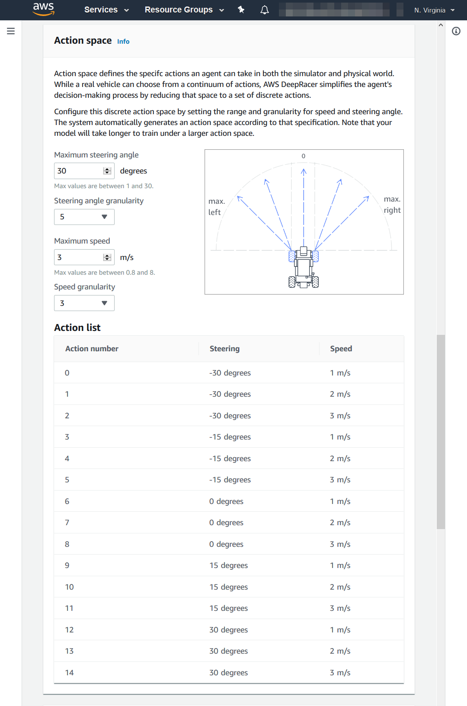
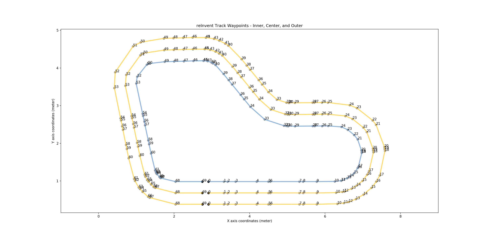
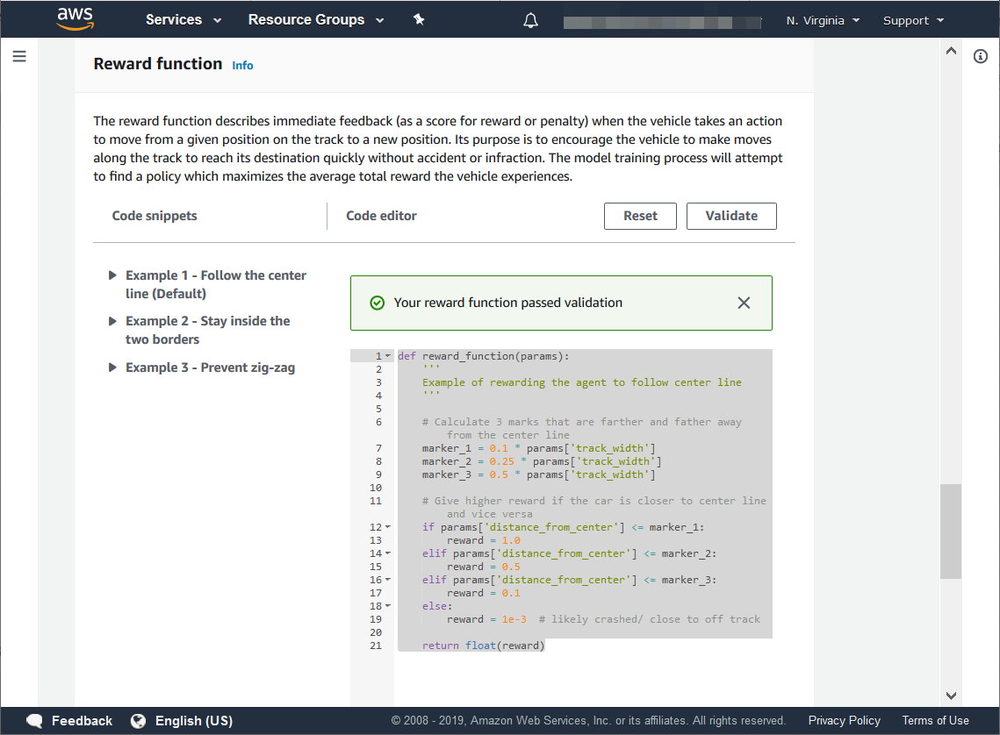
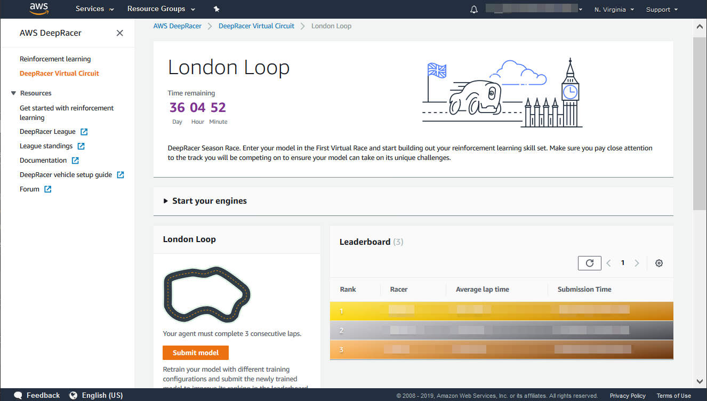
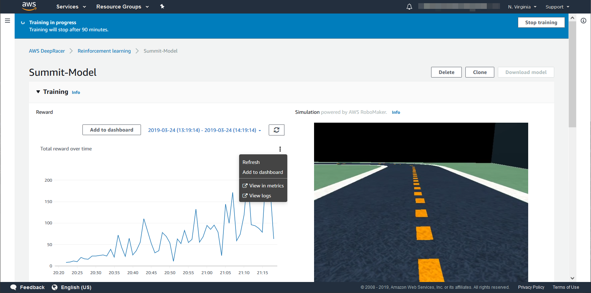
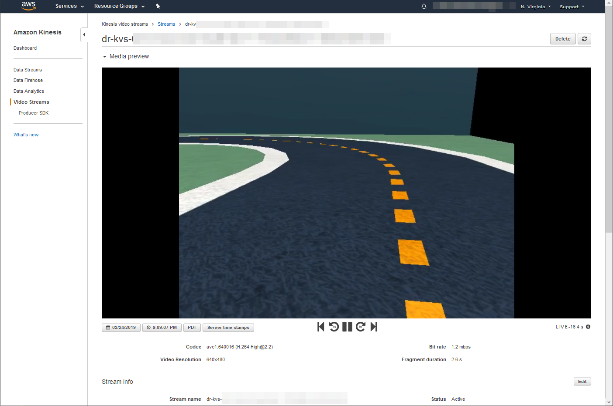

# Lab 1: AWS DeepRacer の強化学習モデルを構築しましょう!

# Notes
We are continuously looking to improve the AWS DeepRacer service to provide a better customer experience. As such please always refer to the latest lab content in GitHub as prior content may be outdated. If you do have any technical questions please ask the workshop facilitators, and for those of you working through the lab at home, please post your questions to the [AWS DeepRacer forum](https://forums.aws.amazon.com/forum.jspa?forumID=318).

# Overview
The lab has four goals:

1. familiarize you with the AWS DeepRacer service in the AWS console,
2. explain the concepts needed to get you started training a model,
3. explain how you can compete in the DeepRacer League, both the Virtual Circuit and the Summit Circuit, and
4. explain how you can improve your model.

The lab is split into three sections:

1. Section 1: Training your first model,
2. Section 2: Competing in the AWS DeepRacer League, and
3. Section 3: Model training and improving your model.

Goals one and two are covered in Section 1, goal three is covered in Section 2, and goal four is covered in Section 3.

# Format
You will have 50 minutes to complete the lab and this is enough time to thoroughly go through the content, explore the service, and start training your first AWS DeepRacer reinforcement learning (RL) model. Section 1 should take about 25 to 35 minutes, Section 2 should take about 5 minutes, and Section 3 will take more time than you have in the workshop but is for use at home.

The lab will provide detail on the various components in the AWS DeepRacer service in the console and you will get the chance to try them all out. You should will start training your model at the end of Section 1.

# Hints
- Please make sure you save your reward function, and download your trained model from the burner account. You will lose access to the account after the Summit, and the account will be wiped.
- For those eager to start training a job, our hint would be take your time and familiarize yourself with the concepts first, before starting model training. 
- Please ask questions as you progress through the lab and feel free to have discussions at your table. 
- Lastly, when you do start a training job, run it for at least 90 minutes (on the re:Invent track). It takes 6 minutes to spin up the services needed and your model needs time to explore the track before it will manage to complete a lap.
- If you want to continue learning after the lab, please check out the new course by the AWS Training and Certification team, called [AWS DeepRacer: Driven by Reinforcement Learning](https://www.aws.training/learningobject/wbc?id=32143)

# Section 1: Training your first model
## Step 1: Login to the AWS DeepRacer service
Log into the [AWS Console](https://signin.aws.amazon.com/signin?redirect_uri=https%3A%2F%2Fconsole.aws.amazon.com%2Fconsole%2Fhome%3Fnc2%3Dh_ct%26src%3Dheader-signin%26state%3DhashArgs%2523%26isauthcode%3Dtrue&client_id=arn%3Aaws%3Aiam%3A%3A015428540659%3Auser%2Fhomepage&forceMobileApp=0) using the account details provided.

Make sure you are in the **North Virginia** region and navigate to [AWS DeepRacer](https://console.aws.amazon.com/deepracer/home?region=us-east-1) (https://console.aws.amazon.com/deepracer/home?region=us-east-1).

From the AWS DeepRacer landing page, expand the pane on the left and select **Reinforcement learning**.

## Step 2: Model List Page
Once you select Reinforcement learning, you will land on the models page. This page shows a list of all the models you have created and the status of each model. If you want to create models, this is where you start the process. Similarly, from this page you can download, clone, and delete models.

If you don't have any models this list will be empty, and you can create a model by choosing **Create model**.
Once you have created a model you can use this page to view the status of the model, for example is it training, or ready. A model status of "ready" indicates model training has completed and you can then download it, evaluate it, or submit it to a virtual race. You can click on the model's name to proceed to the **Model details** page. 

To create your first model select **Create model**.

## Step 3: Create model
This page gives you the ability to create an RL model for AWS DeepRacer and start training the model. There are a few sections on the page, but before we get to each please scroll all the way down the page and then all the way back up so you get a sense of what is to come. We are going to create a model that can be used by the AWS DeepRacer car to autonomously drive (take action) around a race track. We need to select the specific race track, provide the actions that our model can choose from, provide a reward function that will be used to incentivize our desired driving behavior, and configure the hyperparameters used during training. 

### **Info** **Buttons**
Throughout the console you will see **Info** buttons. When selected, an information pane will slide onto the screen from the right of the window. Info buttons will not navigate away from the current page, unless you select a link in the information pane. You can close the panes once you are done.

## 3.1 Model details
You should start at the top with Model Details. Here you can name your model and provide a description for your model. If this is the first time you use the service you should select the **Create Resources** button. This will create the IAM roles that AWS DeepRacer needs to call other AWS services on your behalf, the VPC stack used during training and evaluation, the AWS DeepRacer lambda function used to validate your Python 3 reward function, and the AWS DeepRacer S3 bucket where model artifacts will be stored. If you see an error in this section please let us know.

Please enter a name and description for your model and scroll to the next section.

## 3.2 Environment simulation
As detailed in the workshop, training our RL model takes place on a simulated race track in our simulator, and in this section you will choose the track on which you will train your model. AWS RoboMaker is used to spin up the simulation environment.

When training a model, keep the track on which you want to race in mind. Train on the track most similar to the final track you intend to race on. While this isn't required and doesn't guarantee a good model, it will maximize the odds that your model will get its best performance on the race track. Furthermore, if you train on a straight track, don't expect your model to learn how to turn.

We will provide more details on the AWS DeepRacer League in Section 2, but here are things to keep in mind when selecting a track to train on if you intent to race in the League.

- For the [Summit Circuit](https://aws.amazon.com/deepracer/summit-circuit/), the live race track will be the re:Invent 2018 track, so train your model on the re:Invent track if you intend to race at any of the selected AWS Summits. 
- Each race in the Virtual Circuit will have its own new competition track and it won't be possible to directly train on the competition tracks. Instead we will make a track available that will be similar in theme and design to each competition track, but not identical. This ensures that models have to generalize, and can't just be over fitted to the competition track. 

For today's lab we want to get you ready to race at the Summit, time permitting, so please select the re:Invent 2018 track and scroll to the next section.

## 3.3 Action space
In this section you get to configure the action space that your model will select from during training, and also once the model has been trained. An action is a combination of speed and steering angle. In AWS DeepRacer we are using a discrete action space as opposed to a continuous action space. To build this discrete action space you will specify the maximum speed, the speed granularity, the maximum steering angle, and the steering granularity.

Inputs

- Maximum steering angle is the maximum angle in degrees that the front wheels of the car can turn, to the left and to the right. There is a limit as to how far the wheels can turn and so the maximum turning angle is 30 degrees.
- Steering levels refers to the number of steering intervals between the maximum steering angle on either side.  Thus if your maximum steering angle is 30 degrees, then +30 degrees is to the left and -30 degrees is to the right. With a steering granularity of 5, the following steering angles, from left to right, will be in the action space: 30 degrees, 15 degrees, 0 degrees, -15 degrees, and -30 degrees. Steering angles are always symmetrical around 0 degrees.
- Maximum speeds refers to the maximum speed the car will drive in the simulator as measured in meters per second. 
- Speed levels refers to the number of speed levels from the maximum speed (including) to zero (excluding). So if your maximum speed is 3 m/s and your speed granularity is 3, then your action space will contain speed settings of 1 m/s, 2m/s, and 3 m/s. Simply put 3m/s divide 3 = 1m/s, so go from 0m/s to 3m/s in increments of 1m/s. 0m/s is not included in the action space.

Based on the above example the final action space will include 15 discrete actions (3 speeds x 5 steering angles), that should be listed in the AWS DeepRacer service. If you haven't done so please configure your action space. Feel free to use what you want to use. Larger action spaces may take a bit longer to train.

Hints

- Your model will not perform an action that is not in the action space. Similarly, if your model is trained on a track that that never required the use of this action, for example turning won't be incentivized on a straight track, the model won't know how to use this action as it won't be incentivized to turn. Thus as you start thinking about building a robust model make sure you keep the action space and training track in mind.  
- Specifying a fast speed or a wide steering angle is great, but you still need to think about your reward function and whether it makes sense to drive full-speed into a turn, or exhibit zig-zag behavior on a straight section of the track.
- Our experiments have shown that models with a faster maximum speed take longer to converge than those with a slower maximum speed.
- For real world racing you will have to play with the speed in the webserver user interface of AWS DeepRacer to make sure your car is not driving faster than what it learned in the simulator.

## 3.4 Reward function
In reinforcement learning, the reward function plays a **critical** role in training your models. The reward function is used to incentivize the driving behavior you want the agent to exhibit when using your trained RL model to make driving decisions. 

The reward function evaluates the quality of an action's outcome, and rewards the action accordingly. In practice the reward is calculated during training after each action is taken, and forms a key part of the experience (recall we spoke about state, action, next state, reward) used to train the model. You can build the reward function logic using a number of variables that are exposed by the simulator. These variables represent measurements of the car, such as steering angle and speed, the car in relation to the racetrack, such as (x, Y) coordinates, and the racetrack, such as waypoints. You can use these measurements to build your reward function logic in Python 3 syntax.

The following table contains the variables you can use in your reward function. Note these are updated from time to time as our engineers and scientists find better ways of doing things, so adjust your previous reward functions accordingly. At the time of the Singapore Summit (10 April 2019) these variables and descriptions are correct in the AWS DeepRacer service in the AWS console. Always use the latest descriptions in the AWS DeepRacer service. Note, if you use the SageMaker RL notebook, you will have to look at the syntax used in the notebook itself.

| Variable Name        | Syntax                                                                                | Type                     | Description                                                                                                                                                                                                                                                                                                                                                         |
|----------------------|---------------------------------------------------------------------------------------|--------------------------|---------------------------------------------------------------------------------------------------------------------------------------------------------------------------------------------------------------------------------------------------------------------------------------------------------------------------------------------------------------------|
| all_wheels_on_track  | params['all_wheels_on_track']                                                         | Boolean                  | If all of the four wheels is on the track, where track is defined as the road surface including the border lines, then all_wheels_on_track is True. If any of the four wheels is off the track, then all_wheels_on_track is False. Note if all four wheels are off the track, the car will be reset.                                                                             |
| x                    | params['x']                                                                           | Float                    | Returns the x coordinate of the center of the front axle of the car, in unit meters.                                                                                                                                                                                                                                                                                 |
| y                    | params['y']                                                                           | Float                    | Returns the y coordinate of the center of the front axle of the car, in unit meters.                                                                                                                                                                                                                                                                                 |
| distance_from_center | params['distance_from_center']                                                        | Float [0, track_width/2] | Absolute distance from the center of the track. Center of the track is determined by the line that links all center waypoints.                                                                                                                                                                                                                                      |
| is_left_of_center    | params['is_left_of_center']                                                           | Boolean                  | A variable that indicates if the car is to the left of the center of the track.                                                                                                                                                                                                                                                                                     |
| is_reversed          | params['is_reversed']                                                                 | Boolean                  | A variable indicating whether the car is training in the original direction of the track, or the reverse direction of the track.                                                                                                                                                                                                                                    |
| heading              | params['heading']                                                                     | Float (-180,180]           | Returns the heading the car is facing in degrees. When the car faces the direction of the x-axis increasing (and y constant), then it will return 0. When the car faces the direction of the y-axis increasing (with x constant), then it will return 90. When the car faces the direction of the y-axis decreasing (with x constant), then it will return -90. |
| progress             | params['progress']                                                                    | Float [0,100]            | Percentage of the track complete. Progress of 100 indicates the lap is completed.                                                                                                                                                                                                                                                                                   |
| steps                | params['steps']                                                                       | Integer [0,inf]                 | Number of steps completed. One step is one (state, action, next state, reward tuple).                                                                                                                                                                                                                                                                               |
| speed                | params['speed']                                                                       | Float                    | The desired speed of the car in meters per second. This should tie back to the selected action space.                                                                                                                                                                                                                                                               |
| steering_angle       | params['steering_angle']                                                              | Float                    | The desired steering_angle of the car in degrees. This should tie back to the selected action space. Note that + angles indicate going left, and negative angles indicate going right. This is aligned with 2d geometric processing.                                                                                       |
| track_width          | params['track_width']                                                                 | Float                    | The width of the track, in unit meters.                                                                                                                                                                                                                                                                                                                             |
| waypoints            | params['waypoints'] for the full list or params['waypoints'][i] for the i-th waypoint | List                     | Ordered list of waypoints, that are spread around the track in the center of the track, with each item in the list being the (x, y) coordinate of the waypoint. The list starts at zero.                                                                                                                                                                            |
| closest_waypoints    | params['closest_waypoints'][0] or params['closest_waypoints'][1]                      | Integer                  | Returns a list containing the nearest previous waypoint index, and the nearest next waypoint index. params['closest_waypoints'][0] returns the nearest previous waypoint index and params['closest_waypoints'][1] returns the nearest next waypoint index.                                                                                                          |
|                      |                                                                                       |                          |                                                                                                                                                                                                                                                                                                                                                                     |
|                      |                                                                                       |                          |                                                                                                                                                                                                                                                                                                                                                                     |
|                      |                                                                                       |                          |                                                                                                                                                                                                                                                                                                                                                                     |

Here is a visual explanation of some of the reward function parameters.

Here is a visualization of the waypoints used for the re:Invent track. You will only have access to the centerline waypoints in your reward function. Note also that you can recreate this graph by just printing the list of waypoints in your reward function and then plotting them. When you use a print function in your reward function, the output will be placed in the AWS RoboMaker logs. You can do this for any track you can train on. We will discuss logs later.

A useful method to come up with a reward function, is to think about the behavior you think a car that drives well will exhibit. A simple example would be to reward the car for staying on the road. This can be done by setting reward = 1, always. This will work in our simulator, because when the car goes off the track we reset it, and the car starts on the track again so we don't have to fear rewarding behavior that leads off the track. However, this is probably not the best reward function, because it completely ignores all other variables that can be used to craft a good reward function.

Below we provide a few reward function examples. 

**Example 1**:Basic reward function that promotes centerline following.
Here we first create three bands around the track, using the three markers, and then proceed to reward the car more for driving in the narrow band as opposed to the medium or the wide band. Also note the differences in the size of the reward. We provide a reward of 1 for staying in the narrow band, 0.5 for staying in the medium band, and 0.1 for staying in the wide band. If we decrease the reward for the narrow band, or increase the reward for the medium band, we are essentially incentivizing the car to be use a larger portion of the track surface. This could come in handy, especially when there are sharp corners.

	def reward_function(params):
		'''
		Example of rewarding the agent to follow center line
		'''
		
		# Calculate 3 marks that are farther and father away from the center line
		marker_1 = 0.1 * params['track_width']
		marker_2 = 0.25 * params['track_width']
		marker_3 = 0.5 * params['track_width']
		
		# Give higher reward if the car is closer to center line and vice versa
		if params['distance_from_center'] <= marker_1:
			reward = 1.0
		elif params['distance_from_center'] <= marker_2:
			reward = 0.5
		elif params['distance_from_center'] <= marker_3:
			reward = 0.1
		else:
			reward = 1e-3  # likely crashed/ close to off track
		
		return float(reward)

Hint: Don't provide rewards equal to zero. The specific optimizer that we are using struggles when the reward given is zero. As such we initialize the reward with a small value. 

**Example 2**:Advanced reward function that penalizes excessive steering and promotes centerline following.

	def reward_function(params):
		'''
		Example that penalizes steering, which helps mitigate zig-zag behaviors
		'''

		# Calculate 3 marks that are farther and father away from the center line
		marker_1 = 0.1 * params['track_width']
		marker_2 = 0.25 * params['track_width']
		marker_3 = 0.5 * params['track_width']

		# Give higher reward if the car is closer to center line and vice versa
		if params['distance_from_center'] <= marker_1:
			reward = 1
		elif params['distance_from_center'] <= marker_2:
			reward = 0.5
		elif params['distance_from_center'] <= marker_3:
			reward = 0.1
		else:
			reward = 1e-3  # likely crashed/ close to off track

		# Steering penality threshold, change the number based on your action space setting
		ABS_STEERING_THRESHOLD = 15

		# Penalize reward if the car is steering too much
		if abs(params['steering_angle']) > ABS_STEERING_THRESHOLD:  # Only need the absolute steering angle
			reward *= 0.5

		return float(reward)
		

**Example 3**:Advanced reward function that penalizes going slow and promotes centerline following.

	def reward_function(params):
		'''
		Example that penalizes slow driving. This create a non-linear reward function so it may take longer to learn.
		'''

		# Calculate 3 marks that are farther and father away from the center line
		marker_1 = 0.1 * params['track_width']
		marker_2 = 0.25 * params['track_width']
		marker_3 = 0.5 * params['track_width']

		# Give higher reward if the car is closer to center line and vice versa
		if params['distance_from_center'] <= marker_1:
			reward = 1
		elif params['distance_from_center'] <= marker_2:
			reward = 0.5
		elif params['distance_from_center'] <= marker_3:
			reward = 0.1
		else:
			reward = 1e-3  # likely crashed/ close to off track

		# penalize reward for the car taking slow actions
		# speed is in m/s
		# the below assumes your action space has a maximum speed of 5 m/s and speed granularity of 3
		# we penalize any speed less than 2m/s
		SPEED_THRESHOLD = 2
		if params['speed'] < SPEED_THRESHOLD:
			reward *= 0.5

		return float(reward)

Using the above examples you can now proceed to craft your own reward function. Here are a few other tips:

- You can use the waypoints to calculate the direction from one waypoint to the next.
- You can use the right-hand rule from 2D gaming to determine on which side of the track you are on.
- You can scale rewards exponentially, just cap them at 10,000.
- Keep your action space in mind when using speed and steering_angle in your reward function
- To keep track of episodes in the logs where your car manages to complete a lap, consider giving a finish bonus (aka reward += 10000) where progress = 100. This is because once the car completes a lap progress will not go beyond 100, but the simulation will continue. The model will keep on training until it reaches the stopping time, but that does not imply the final model is the best model, especially when it comes to racing in the real world. This is a temporary workaround as we will solve.

Once you are done creating your reward function be sure to use the **Validate** button to verify that your code syntax is good before training begins. When you start training this reward function will be stored in a file in your S3, but also make sure you copy and store it somewhere to ensure it is safe.

Here is my example reward function using the first example above.

Please scroll to the next section.

## 3.5 アルゴリズム設定
このセクションでは、強化学習で使われるハイパーパラメータを指定します。ハイパーパラメータを指定することでパフォーマンスが改善します。

実施する前に、用語について説明します。

経験としても知られる **step** は、 (s,a,r,s’)のタプル型です。s はカメラによってキャプチャされた観測（または状態）、a は車両によって行われた行動、r は行動によって生じる報酬、s は行動から得られた新しい観測（または新しい状態）です。

**episode** は、車両がスタート地点から出発し、最終的にトラックを完走するか、またはトラックから外れるまでの期間です。つまり、 episodeは、一連のstep、つまり経験です。異なるepisodeは、長さが異なる場合があります。

**experience buffer** は、トレーニング中に様々な長さの一定数のepisodeで収集された順序付けられたstepで構成されています。experience bufferは、ニューラルネットワークを更新するための基本情報（方策と価値）として機能します。

**batch** は、順序付けられた 経験のリストで、一定期間に渡るシミュレーションで得られた経験の一部を表し、policy networkの重みの更新で使用されます。

experience buffer からランダムにサンプリングされたセットを **training data set** と呼び、policy network の重みを更新するのに使用されます。

これらのパラメータは専門家によってテストおり、re:Inventのトラックと、小さな action space でうまく機能するようになっているので、あまり変更しないでください。ただし、トレーニングの収束性を大幅に改善することができるので、モデルのイテレーションを開始するときに変更することを検討してください。

| Parameter                                | Description                                                                                                                                                                                                                                                                                                                                                                                                                                                                                                                                                                      |
|------------------------------------------|----------------------------------------------------------------------------------------------------------------------------------------------------------------------------------------------------------------------------------------------------------------------------------------------------------------------------------------------------------------------------------------------------------------------------------------------------------------------------------------------------------------------------------------------------------------------------------|
| Batch size                               | 車両の経験は、experience bufferからランダムでサンプリングされ、ディープニューラルネットワークの重みを更新するため使用されます。例えば、experience bufferに5120の経験があり、ランダムサンプリングを無視してバッチサイズを512を指定すると、10のバッチ得られます。各バッチは、重みの更新に使用されます。バッチサイズを大きくした場合、重みの更新は安定しますが、トレーニングが遅くなる可能性があるので注意してください。|
| Number of epochs                         |  エポックは、すべてのバッチを1回実行することを表し、重みは各バッチが処理される毎に更新されます。例えば、10 エポックの場合、すべてのバッチを使用して重みを更新するプロセスを10回繰り返すことを意味します。エポックを増やすことでより安定して重みを更新できますが、トレーニングが遅くなります。バッチサイズが小さい場合は、少ないepochを使用できます。|
| Learning rate                            |  学習率は、重みを更新する大きさを制御します。簡単に言えば、方策の重みを変えて累積報酬を最大にしたい場合、方策をどれだけ変えるべきかということです。学習率を大きくするとトレーニングは早くなりますが、収束しにくくなります。学習率を小さくすると収束は安定しますが、トレーニングに時間がかかります。|
| Exploration                              |  探索と搾取の間のトレードオフを決めるために使用する方法を指定します。言い換えると、探索をやめるべきか（ランダムに行動）、これまでの経験を利用するべきかを決定するためにどのような方法を使うべきか、ということです。個別のaction spaceを使うので、必ずCategoricalParametersを選択してください。|
| Entropy                                  | action spaceの確率分布に追加された、ある程度の不確実性、ランダム性。ランダムにアクションを選択して 状態/action space をより広く探索するのに役立ちます。|
| Discount factor                          | 割引率は、将来の報酬が予想累積報酬にどれだけ寄与するかを指定します。割引率を大きくすると、モデルは予想累積報酬を決定し、トレーニングが遅くなります。例えば割引率が0.9の場合、車両は移動のために将来の10 stepに報酬が含まれることになります。0.999の割引率であれば、車両は移動するために将来の1000ステップに報酬が含まれることになります。推奨される割引率は、0.99、0.999、および0.9999です。|
| Loss type                                | 損失タイプは、重みを更新するために使用される目的関数（コスト関数）のことです。Huberと平均二乗誤差は、小規模な更新でも同様に動作します。しかし、更新が大きくなるに連れてHuberの損失は、平均二乗誤差の損失に比べて増分が小さくなります。学習の収束に問題が有る場合、Huberを使います。収束性がよく、より早くトレーニングしたい場合は平均二乗誤差を使用してください。|
| Number of episodes between each training |  このパラメータは、各モデルのトレーニング・イテレーション毎に車両がどれだけ経験を得るべきかを制御します。例えば多くの極大値を持つ複雑な問題の場合、experience bufferは多くの無相関データが必要です。大きくした場合、トレーニングは遅くなりますが安定します。推奨値は、10、20、40です。|

各トレーニング・イテレーション後に新しいモデルはS3バケットに保存します。AWS DeepRacerサービスは、トレーニング実行中にすべてのモデル表示するのではなく、最後のモデルだけを表示します。これらについては Section 3を参照してください。

## 3.6 停止条件
トレーニングを始める前の最後のセクションです。ここではモデルがトレーニングする最大時間を指定できます。可能であれば、この条件を入力すべきです。いつでも早くトレーニングをやめることが出来ます。もし入力した条件の結果としてモデルが停止した場合は、モデル一覧画面に遷移し、モデルを複製して新しいパラメータを使用してトレーニングを再開できます。

90分を指定してから、**Start training** を選択してください。エラーになった場合、エラー箇所に移動します。Pythonのシンタックスも検証されます。トレーニングを開始したら、トレーニングを開始するために必要なサービスが起動するまでに最大6分かかります。この間に AWS DeepRacer リーグと、どのように参加するのかを説明します。

この時点までに25〜35分の実験時間が経過しているはずです。

ヒント：報酬機能の保存を確認し、トレーニング済みモデルをバーナーアカウントからダウンロードしてください。Summit後にアカウントへのアクセスを失い、削除されます。

！[停止条件]（img / stop_conditions.png）

この時点までに25〜35分の実験時間が経過しているはずです。

ヒント：報酬機能を確実に保存し、トレーニング済みモデルをバーナーアカウントからダウンロードしてください。あなたはサミットの後アカウントへのアクセスを失い、アカウントは削除されます。

# Section 2: Competing in the AWS DeepRacer League
The [AWS DeepRacer League](https://aws.amazon.com/deepracer/league/) is the world's first global autonomous racing league. The League will take place in 2019 in-person, at various selected locations, and online. Race and you stand to win one of many AWS DeepRacer prizes, or one of 47 paid trips to re:Invent 2019 where you will get to take part in the AWS DeepRacer Knockout Rounds. If you make it through the Knockouts you will get to race in the AWS DeepRacer Championship Cup. [Terms and conditions insert link here]() apply.

The in-person races are referred to as the Summit Circuit, and the online races are referred to as the Virtual Circuit. The locations of the Summit Circuit events can be found [here](https://aws.amazon.com/deepracer/summit-circuit/). The details of the Virtual Circuit will be announced when the AWS DeepRacer service is opened for general availability. You don't need to own an AWS DeepRacer to take part in either form of competition.

## Racing in the Summit Circuit
To race in the Summit Circuit you must bring your trained AWS DeepRacer RL model to the Summit on a USB stick in a folder called models. Note that we will also provide standard models as part of a walk-up experience for those who were not able to train their own models. At each even you will have to queue for time on the track, on a first come first serve basis, or as the Summit organizer determined, and have 4 minutes to try and get the best lap time using your model and a standard AWS DeepRacer car that we will make available to race with on the race track. The race track will be the re:Invent 2018 track, so train your model on the re:Invent track if you intend to race at any of the selected AWS Summits. The fastest racer at each race in the Summit Circuit will proceed to re:Invent and the top 10 at each race will win AWS DeepRacer cars.

## Racing in the Virtual Circuit
To race in the Virtual Circuit you will have to enter your models into each race, by submitting them via the AWS DeepRacer service in the AWS console. Virtual Circuit races can be seen in the [DeepRacer Virtual Circuit](https://console.aws.amazon.com/deepracer/home?region=us-east-1#leaderboards) section in the AWS DeepRacer service.

Scroll down for a list of open races

To see more info on the race, select race information.

Once you have a trained model, you can  submit it into the current open race. Your model will then be evaluated by the AWS DeepRacer service on the indicated competition track. After your model has been evaluated you will see your standing update if your lap time was better than your prior submission.

Each race in the Virtual Circuit will have its own new competition track and it won't be possible to directly train on the competition tracks. Instead we will make a track available that will be similar in theme and design to each competition track, but not identical. This ensures that models have to generalize, and can't just be overfitted to the competition track. The fastest racer in each race in the Virtual Circuit will proceed to re:Invent and the top 10 at each race will win AWS DeepRacer cars.

**Tip**: The DeepRacer service does not currently support importing models,  but you can still save your model.tar.gz file, as well as all model training artifacts. The final model is stored as model.tar.gz file in a folder called DeepRacer-SageMaker-rlmdl-account number-date in your DeepRacer S3 bucket. The interim models are stored as .pd files in a folder called DeepRacer-SageMaker-RoboMaker-comm-account number-date

After each event in the Summit Circuit and in the Virtual Circuit, all racers that took part will receive points based on the time it took them to complete the race. Points will aggregate through the season, and at the end of the seasons the top point getters will be invited to take part at re:Invent. Please refer to the [terms and conditions insert link here](https://aws.amazon.com/deepracer/faqs/#AWS_DeepRacer_League) for more details. 

# Section 3: Model training and improving your model

## 3.1: While your model is training

After your model has started training you can select it from the listed models. You can then see the how the training is progressing by looking at the total reward per episode graph, and also at the first person view from the car in the simulator. 

At first your car will not be able to drive on a straight road but as it learns better driving behavior you should see its performance improving, and the reward graph increasing. Furthermore, when you car drives off of the track it will be reset on the track. Don't be alarmed if your car doesn't start at the same position. We have enabled round robin to allow the car to start at subsequent points on the track each time to ensure it can train on experience from the whole track. Furthermore, during training you may see your car start training in the opposite direction of the track. This is also done to ensure the model generalizes better, and is not caught off guard by an asymmetrical count between left and right hand turns. Lastly, if you see your car aimlessly drive off track and not resetting, this is when the experience obtained is sent back to Amazon SageMaker to train the model. Once the model has been updated, the new model will be sent back to AWS RoboMaker and the car will resume.

You can look at the log files for both Amazon SageMaker and AWS RoboMaker. The logs are outputted to Amazon CloudWatch. To see the logs, hover your mouse over the reward graph and select the three dots that appear below the refresh button, please then select **View logs**.

You will see the logs of the Python validation lambda, Amazon SageMaker, and AWS RoboMaker.

Each folder will contain the logs for all training jobs that you have executed in AWS DeepRacer. AWS RoboMaker logs will contain output from the simulator, and the Amazon SageMaker logs will contain output from the model training. If there are any errors, the logs are a good place to start.

The AWS DeepRacer service makes use of Amazon SageMaker, AWs RoboMaker, Amazon S3, Amazon Kinesis Video Streams, AWS Lambda, and Amazon CloudWatch. You can navigate to each of these services to get an update on the service's status or for other useful information.

In each service you will see a list of current and prior jobs, where retained. Here is a view of training jobs executed in Amazon SageMaker.

In Amazon SageMaker you will be able to see the logs as well as utilization of the EC2 instance spun up to run training.

In AWS RoboMaker you can see the list of all simulation jobs, and for active jobs you can get a direct view into the simulation environment.

You can select your active simulation job from the list and then select the Gazebo icon. 

This will open a new window showing you the simulation environment. **Take care in this environment because any changes you make to it will affect your simulation in real time. Thus if you accidentally drag or rotate the vehicle or the environment, it may negatively affect your training job.**

 

The Amazon Kinesis Video Stream is typically deleted after use to free up space and due to limits on the number of streams. Note also that at present the video is not yet stored in your S3 account, for both training and evaluations.

Amazon S3 will store the final model, that is referenced in the AWS DeepRacer service, and interim models trained during your training jobs in the aws-deepracer bucket. Your reward functions will also be stored in the same bucket.

The final model is stored as model.tar.gz file in a folder called DeepRacer-SageMaker-rlmdl-account number-date in your DeepRacer S3 bucket.  
The interim models are stored as .pd files in a folder called DeepRacer-SageMaker-RoboMaker-comm-account number-date

The AWS DeepRacer service can at the time of writing only reference one final model for each training job. However, should you want to swap out the model trained during the final training iteration, with any model trained in the training iterations running up to the final, you can simple swap out the model.pb file in the final model.tar.gz file. Note that you should not change the other files in the .tar.gz as this may render the model useless. Do this after your model has stopped training, or after you manually stopped training.

## 3.2: Evaluating the performance of your model

You may not have time in the workshop to do from step 2 onwards. Once your model training is complete you can start model evaluation. From your model details page, where you observed training, select **Start evaluation**. You can now select the track on which you want to evaluate the performance of your model and also the number of laps. Select the re:Invent 2018 track and 5 laps and select Start. 

Once done you should see something as follows.

## 3.3: Race in the AWS DeepRacer League

If you are happy with your model you can go race in the [Summit Circuit](https://aws.amazon.com/deepracer/summit-circuit/) or right now in the [Virtual Circuit](https://console.aws.amazon.com/deepracer/home?region=us-east-1#leaderboards). You can submit your trained model into the Virtual Circuit's current open race [here](https://console.aws.amazon.com/deepracer/home?region=us-east-1#leaderboards).

## 3.4: Iterating and improving your model

Based on the evaluation of the model you should have a good idea as to whether your model can complete the track reliably, and what the average lap time is. Note that for the Virtual Circuit races you will have to complete a certain number of laps consecutively with your model, and so focus on building a reliable model. The number of laps will be determined race by race.

At this point you have to experiment and iterate on your reward function and hyperparameters. It is best to try a few different reward functions based on different driving behavior, and then evaluate them in the simulator to select the best performing one. If you have an AWS DeepRacer you can also test them in the real world.

Hints:
- Increase training time beyond. If your model can't reliably complete a lap try to extend your model training time.
- Try modifying action space by increasing max speed to get faster lap times.
- Tweak your reward function to incentivize your car to drive faster : you’ll want to specifically modify progress, steps and speed variables.
- Clone your model to leverage training experience. Please note that you will not be able to change action space once a model is cloned, otherwise the job will fail.

## 3.5: Analyze model performance by inspecting the RoboMaker logs
If you do want to go a step further, you can evaluate the performance of each model that was trained during the training job by inspecting the log file.

To download the log file from CloudWatch you can use the following code with [Amazon CLI](https://docs.aws.amazon.com/polly/latest/dg/setup-aws-cli.html).  

**Download the RoboMaker log from CloudWatch**

1. [Quick Analysis] Get last 10000 lines from the log

	aws logs get-log-events --log-group-name  "/aws/robomaker/SimulationJobs"  --log-stream-name  "<STREAM_NAME>" --output text --region us-east-1 > deepracer-sim.log

2. [Export Entire Log] Copy the log from Amazon Cloudwatch to Amazon S3. Follow the link to export all the logs to [Amazon S3](https://docs.aws.amazon.com/AmazonCloudWatch/latest/logs/S3ExportTasks.html)

You can now analyze the log file using Python Pandas and see which model iterations provided the highest total reward. Furthermore, if you did add a finish bonus, you can see which model iterations were able to finish a lap. These models are good candidates to test in the simulator and in the real world.

